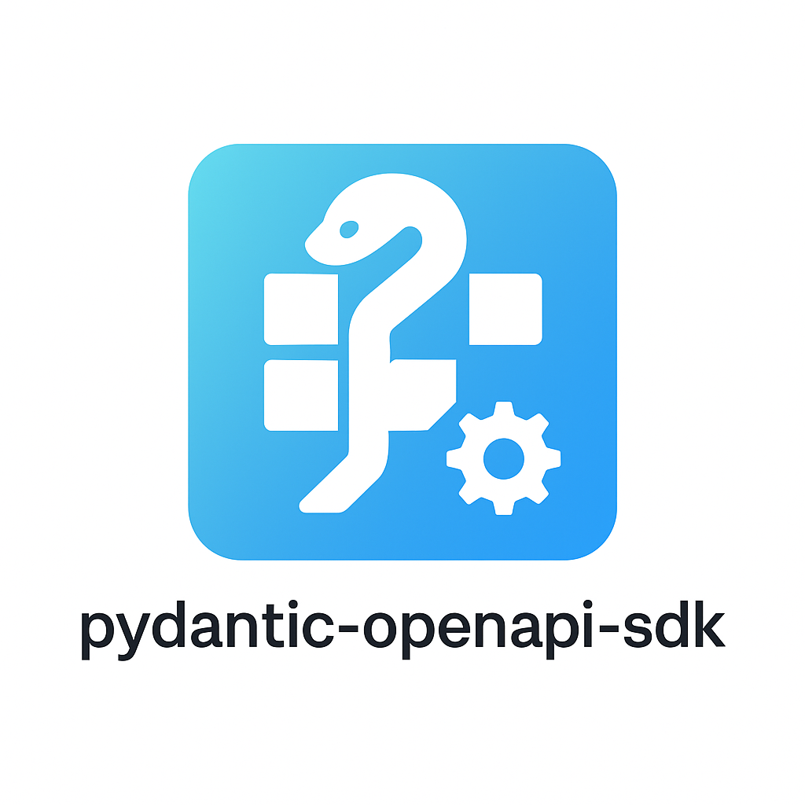

<div align="center">
  
  
  # Pydantic OpenAPI SDK Generator
</div>

> [!WARNING]
> **⚠️ Under Development**  
> This project is currently under development and experimental. APIs, interfaces, and generated code structure may change in future versions. Use with caution in production environments.

Generate Python SDKs from OpenAPI 3.x specifications with Pydantic v2 models and synchronous HTTP clients.

## Features

- **OpenAPI 3.x Support** - Parse YAML/JSON specifications and URLs
- **Synchronous HTTP Client** - Built on httpx for production use
- **Pydantic v2 Models** - Generated using datamodel-code-generator for accuracy
- **Multiple Authentication** - Bearer token, API key, and Basic auth
- **YAML Configuration** - Manage generation settings in config files
- **Code Organization** - Operations grouped by tags, clean structure
- **Type Safety** - Full type hints throughout generated code
- **Error Handling** - Structured exception management
- **Make Integration** - Unified build and test workflows

## Installation

```bash
pip install pydantic-openapi-sdk
```

Or with uv:

```bash
uv add pydantic-openapi-sdk
```

## Quick Start

### 1. Generate SDK

From Swagger Pet Store API:

```bash
pydantic-openapi-sdk generate \
  --spec https://petstore3.swagger.io/api/v3/openapi.json \
  --out ./examples/gen \
  --package petstore \
  --client-name PetStore
```

With configuration file:

```bash
pydantic-openapi-sdk generate --config configs/petstore.yaml
```

### 2. Use Generated SDK

```python
from petstore import PetStore, BearerAuth
from petstore.api import pet, store
from petstore.models import Pet, Category, Tag

# Create client
client = PetStore(
    base_url="https://petstore3.swagger.io/api/v3",
    auth=BearerAuth("your-token")
)

# Find available pets
available_pets = pet.find_pets_by_status(client, status="available")
print(f"Found {len(available_pets)} available pets")

# Get store inventory
inventory = store.get_inventory(client)
print(f"Store inventory: {inventory}")

# Create a new pet
new_pet = Pet(
    name="Buddy",
    category=Category(id=1, name="Dogs"),
    photoUrls=["https://example.com/photo.jpg"],
    tags=[Tag(id=1, name="friendly")],
    status="available"
)
```

## Configuration

### YAML Configuration File

Create a configuration file to manage settings:

```yaml
# petstore.yaml
spec: "https://petstore3.swagger.io/api/v3/openapi.json"
output_dir: "examples/gen"
package_name: "petstore"
base_url: "https://petstore3.swagger.io/api/v3"
verbose: true

# Code generation options
use_union_operator: true

# Model generation options (passed to datamodel-code-generator)
model_options:
  field_constraints: true              # Generate field constraints
  use_standard_typing: false          # Use typing_extensions
  use_generic_container_types: true   # Use list[T] instead of List[T]

# Client options
timeout: 30
user_agent: "pydantic-openapi-sdk/1.0.0"
client_class_name: "PetStore"  # Custom client class name (default: "Client")
```

### CLI Options

| Option          | Description             | Example                      |
| --------------- | ----------------------- | ---------------------------- |
| `--config`      | Configuration file path | `--config config.yaml`       |
| `--spec`        | OpenAPI spec file/URL   | `--spec openapi.json`        |
| `--out`         | Output directory        | `--out ./generated`          |
| `--package`     | Package name            | `--package my_sdk`           |
| `--base-url`    | Default base URL        | `--base-url https://api.com` |
| `--timeout`     | HTTP timeout (seconds)  | `--timeout 60`               |
| `--client-name` | Client class name       | `--client-name ApiClient`    |
| `--verbose`     | Verbose output          | `--verbose`                  |

CLI options override configuration file settings.

## Generated SDK Structure

```text
petstore/
├── __init__.py          # Package exports
├── client.py            # HTTP client and authentication
├── exceptions.py        # Error classes
├── api/
│   ├── __init__.py
│   ├── pet.py           # Pet operations
│   ├── store.py         # Store operations
│   └── user.py          # User operations
└── models/
    └── __init__.py      # Pydantic models
```

## Usage Examples

### Basic Client Usage

```python
from petstore import PetStore, ApiError
from petstore.api import pet

client = PetStore(base_url="https://petstore3.swagger.io/api/v3")

try:
    available_pets = pet.find_pets_by_status(client, status="available")
    print(f"Found {len(available_pets)} available pets")
except ApiError as e:
    print(f"API error: {e.status_code} - {e.message}")
```

### Authentication

```python
from petstore import PetStore, BearerAuth, ApiKeyAuth, BasicAuth

# Bearer token
client = PetStore(
    base_url="https://petstore3.swagger.io/api/v3",
    auth=BearerAuth("your-jwt-token")
)

# API key
client = PetStore(
    base_url="https://petstore3.swagger.io/api/v3",
    auth=ApiKeyAuth("your-api-key", "X-API-Key")
)

# Basic auth
client = PetStore(
    base_url="https://petstore3.swagger.io/api/v3",
    auth=BasicAuth("username", "password")
)
```

### Working with Models

```python
from petstore.models import Pet, Category, Tag
from pydantic import ValidationError

# Create model with validation
try:
    new_pet = Pet(
        name="Buddy",
        category=Category(id=1, name="Dogs"),
        photoUrls=["https://example.com/photo.jpg"],
        tags=[Tag(id=1, name="friendly")],
        status="available"
    )
    # Convert to dict for API call
    api_payload = new_pet.model_dump()
except ValidationError as e:
    print(f"Validation error: {e}")

# Parse response data
response_data = {"id": 1, "name": "John Doe", "email": "john@example.com"}
user = User(**response_data)
```

### Error Handling

```python
from my_api import ApiError
from my_api.api import users

try:
    user = users.get_user(client, user_id=123)
except ApiError as e:
    if e.status_code == 404:
        print("User not found")
    elif e.status_code == 401:
        print("Authentication required")
    elif e.status_code >= 500:
        print("Server error")
    print(f"Full error: {e.body}")
```

### Context Manager

```python
from my_api import Client, BearerAuth

with Client(base_url="https://api.example.com", auth=BearerAuth("token")) as client:
    data = users.get_users(client)
    # Client automatically closes
```

## Development

### Setup

```bash
git clone https://github.com/orangekame3/pydantic-openapi-sdk
cd pydantic-openapi-sdk
make dev
```

### Available Commands

```bash
make help                 # Show available commands
make install             # Install dependencies
make dev                 # Set up development environment
make generate-sdk        # Generate SDK from config
make test               # Test generated SDK
make test-local         # Generate and test locally
make test-real-api      # Full test with real API
make lint               # Run code linting
make format             # Format code
make clean              # Clean generated files
```

### Testing with Real APIs

Test the generator with the Swagger Pet Store API:

```bash
# Full test cycle
make test-real-api

# Or step by step
make download-spec
make generate-local-spec
make test
```

This downloads the official Pet Store OpenAPI spec, generates an SDK, and runs tests against the live API.

## Real-World Example

The repository includes a complete example using the Swagger Pet Store API:

```python
from petstore_sdk import Client
from petstore_sdk.api import pet

client = Client(base_url="https://petstore3.swagger.io/api/v3")
available_pets = pet.find_pets_by_status(client, status="available")
print(f"Found {len(available_pets)} available pets")
```

See [`examples/`](examples/) for complete working examples.

## Architecture

This generator uses:

- **[datamodel-code-generator](https://github.com/koxudaxi/datamodel-code-generator)** - Generates accurate Pydantic v2 models from OpenAPI schemas
- **Jinja2 templates** - Generates client code and API operations
- **httpx** - HTTP client for generated SDKs
- **Custom OpenAPI parser** - Handles operations, parameters, and routing

## Requirements

- Python ≥ 3.10
- Dependencies: httpx, pydantic[email], pyyaml, click, jinja2, datamodel-code-generator

## Current Limitations

- Synchronous client only (async support planned)
- Basic response type mapping
- Manual pagination handling
- Limited file upload support

## Contributing

1. Fork the repository
2. Create a feature branch
3. Make changes with tests
4. Run `make check` to verify code quality
5. Submit a pull request

## License

Apache License 2.0 - see [LICENSE](LICENSE) file for details.
